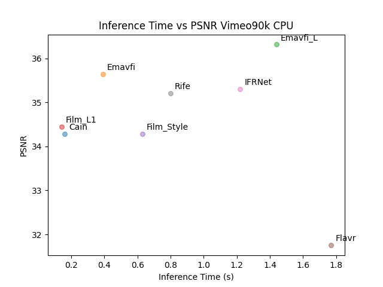
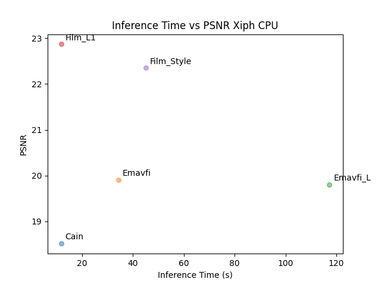
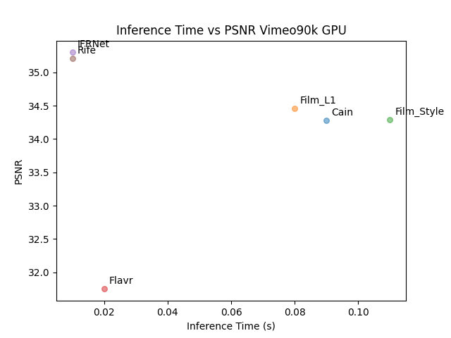
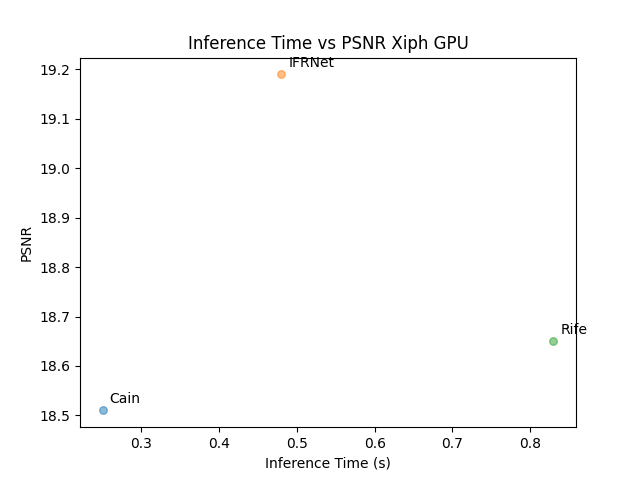

# Realtime Video Frame Interpolation Experiments and Analysis

## Data Used:

1. Vimeo90k:

The data that is used is at the following location: **/storage/dataset/vfi_mos/input_data/mos_data_vimeo90k** on the storage device.

2. Xiph:

The data that is used is at the following location: **/storage/dataset/vfi_mos/input_data/sample_mos_data/xiph** on the storage device.

## Models used:

1. [CAIN](https://myungsub.github.io/CAIN/)
2. [EMAVFI](https://github.com/MCG-NJU/EMA-VFI)
3. [FILM](https://github.com/google-research/frame-interpolation)
4. [FLAVR](https://github.com/tarun005/FLAVR)
5. [IFRNet](https://github.com/ltkong218/IFRNet)
6. [RIFE](https://github.com/megvii-research/ECCV2022-RIFE)

## Notes

1. Pretrained models used for generating result for CAIN, EMAVFI, FLAVR, IFRNet and RIFE. Film_L1_lite_steps2148000 and Film_Style_steps156000 trained models used for FILM.
2. All the experiments are performed on GPU- Nvidia A10 and CPU- Intel(R) Xeon(R) Platinum 8160 CPU @ 2.10GHz
3. First row from the output excel sheet is ignored to calculate the mean value for Inference speed, PSNR and SSIM.

## Results

1. **Vimeo90k MOS CPU**

2. **Xiph MOS CPU**

3. **Vimeo90k MOS GPU**

4. **Xiph MOS GPU**

